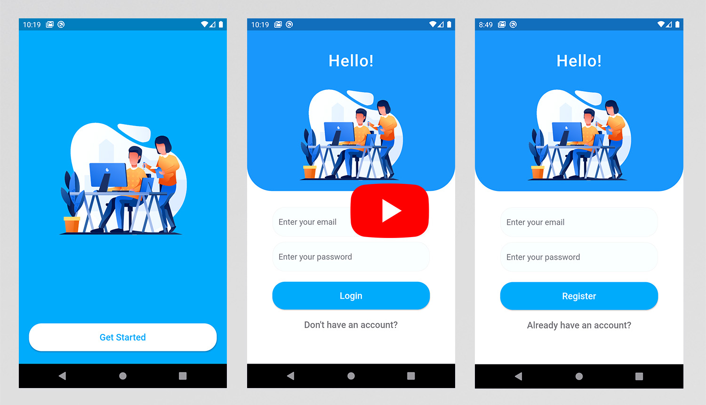
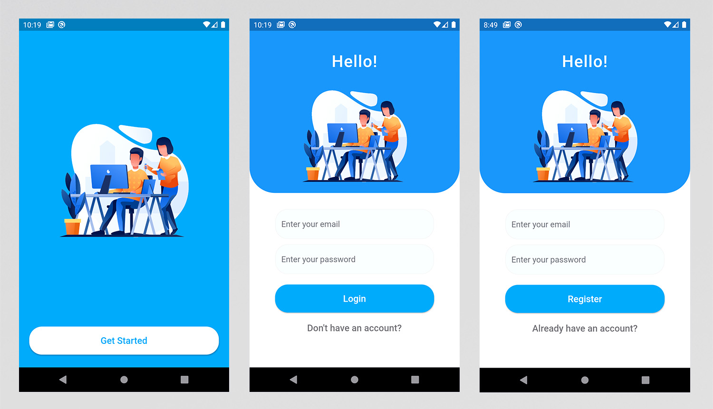

# Authentication-With-Amazing-UI-Flutter
It's an amazing UI for (Intro, Login &amp; Register) screens. In addition, it has full authentication using Firebase Authentication.

## Tutorial
You can watch the tutorial on YouTube yo know how to build these screens and to link them with Firebase Authentication.

## Features :dart:
* [x] Free & Open Source
* [x] Very Easy to use
* [x] Cross Platform App (Android - IOS)
* [x] Amazing UI (Intro, Login & Register screen)
* [x] Simple Animation (Hero)
* [x] Validation
* [x] Firebase Authentication (Login, Register & Logout)
* [x] Email & Password(Sign-in & sign-up method)
* [ ] Google(Sign-in & sign-up method)
* [ ] Facebook(Sign-in & sign-up method)
* [ ] Twitter(Sign-in & sign-up method)
* [ ] Password Reset
* [ ] Email Verification

## Preview (Screens & Gif)

## Language & Framework
* Dart
* Flutter

## Contribtuing 💡
1. Download the repository files (project) from the download section or clone this project by typing in the bash the following command:

       git clone https://github.com/TarekAlabd/Authentication-With-Amazing-UI-Flutter.git
2. Open this project on Android Studio or Visual studio code (or any IDE you use to develop flutter apps).
3. Run the app on the emulator or simulator.
4. Edit and add what you want.
For sure, your pull requests is welcomed. 😃 